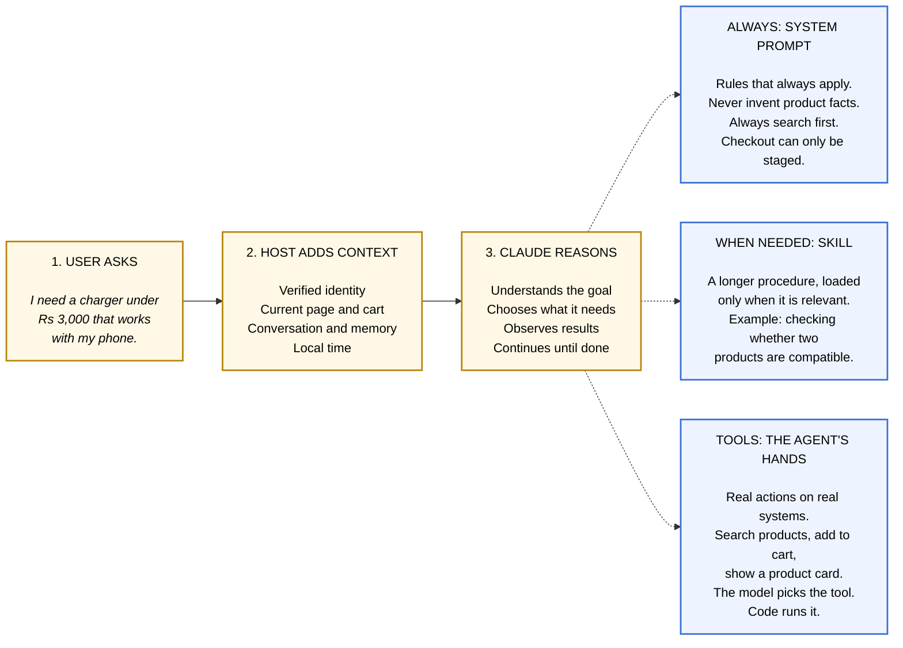
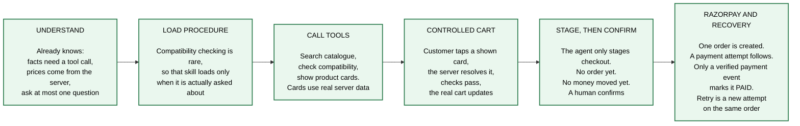
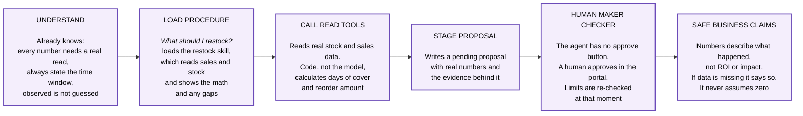
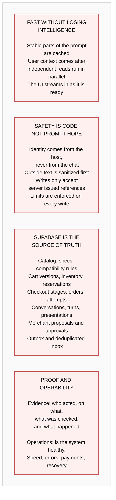
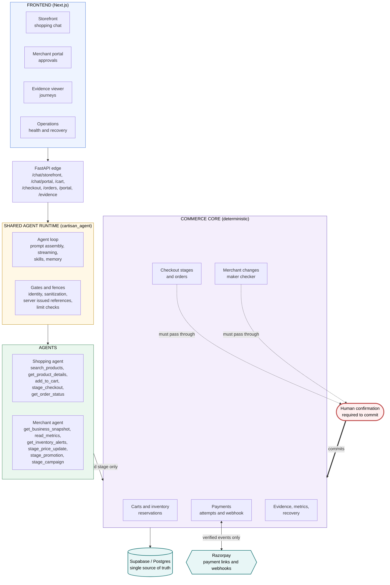

<div align="center">

# Cartisan

**Agentic commerce with a conscience: two Claude agents, one shared runtime, and a deterministic system of record that holds the final word.**

Built for the Razorpay Buildathon.

</div>

---

## The core principle

> Claude decides what to ask and how to explain it.
> Deterministic systems decide what is true, what is allowed, what is committed, what is paid, and what is recoverable.

Every design decision in this repository follows from that one sentence. The model is genuinely in charge of the conversation, and genuinely not in charge of the money.

---

## Where the code lives

| Folder | What it is |
| :--- | :--- |
| `frontend/` | Next.js app: the storefront chat, the merchant portal, the evidence viewer, and the operations console. |
| `backend/` | Python service: both agents, the shared agent runtime, the commerce core, and the Razorpay integration. |

This repository is the combined submission. `backend/` and `frontend/` are Git submodules that track the two source repositories, so their full commit histories live there:

- Frontend repo and history: https://github.com/Simhateja17/razorpay_frontend
- Backend repo and history: https://github.com/Simhateja17/razorpay_backend

Clone the mother repository with its children initialized:

```bash
git clone --recurse-submodules https://github.com/Simhateja17/cartisan.git
```

For an existing checkout, initialize them with `git submodule update --init --recursive`. The mother repository records which commit of each child is used; changes inside either child are committed and pushed in that child repository, then the updated submodule pointer is committed here.

---

## How a request flows

Every single request, on either agent, follows the same shape.



**Why skills instead of one subagent per domain?** Shopping is one continuous conversation. Handing off between agents loses context and adds delay. A skill teaches the same agent a new trick without breaking the flow the customer is already in.

---

## Agent one: the shopping agent

From a vague need to a safe, human confirmed checkout.

It can help with search, comparison, compatible setups, the cart, checkout staging, and order and payment questions.



> **The boundary.** The agent can search, explain, and stage a checkout. It cannot create a payment link, confirm an order, mark an order paid, or issue a refund.

---

## Agent two: the merchant agent

From a business question to a governed, evidence backed proposal.

It can help with sales, inventory, unmet demand, pricing, campaigns, order issues, and pending changes.



> **The boundary.** The agent can read, analyse, explain, and stage. It cannot approve, apply, move stock, change a price, or send money.

---

## The shared engineering foundation

Both agents sit on the same runtime, so both inherit the same speed and the same guarantees.



---

## System map

How the pieces actually wire together.



The source diagram is in [`architecture.excalidraw`](architecture.excalidraw). Open it at [excalidraw.com](https://excalidraw.com) to read the full annotated version.

---

## The payment path, precisely

This is the part that has to be exactly right, so it is worth stating on its own.

1. The agent stages a checkout. Nothing is charged and no order exists yet.
2. A human confirms. Only now is a single order created.
3. A payment attempt is created against that order. A retry creates a **new attempt on the same order**, never a second order.
4. The order becomes `PAID` only when a verified Razorpay webhook event says so. Not when the agent says so, and not when the browser redirect says so.
5. Provider events land in a deduplicated inbox, so a replayed or duplicated webhook cannot double apply.
6. Anything stuck is visible and replayable from the operations console.

---

## Repository layout

```
cartisan/
├── frontend/                  Next.js app
│   ├── app/
│   │   ├── storefront/        Customer shopping chat
│   │   ├── portal/            Merchant console and approvals
│   │   ├── evidence/          Per journey audit trail
│   │   └── operations/        Health, payments, recovery
│   ├── components/            UI and presentation components
│   └── lib/                   API client, stores, formatting
│
└── backend/                   Python service
    ├── api/                   FastAPI edge and request lineage
    ├── cartisan_agent/        Shared runtime: loop, prompts,
    │                          gates, fences, presentations
    │   ├── skills/            Shopping skills
    │   └── merchant_skills/   Merchant skills
    ├── shopping_agent/        Shopping agent wiring
    ├── merchant_agent/        Merchant agent wiring
    ├── commerce_common/       Prompt assembly, streaming,
    │                          grounding, memory, MCP
    ├── marketplace_backend/   Deterministic commerce core:
    │                          carts, checkout, payments,
    │                          inventory, evidence, recovery
    ├── supabase/              Schema and migrations
    └── tests/                 Test suite
```

---

## Skills

Skills are procedures loaded only when the conversation actually needs them, which keeps the base prompt small and the agent fast.

**Shopping:** `compatibility-check`, `build-a-setup`, `checkout-and-payment`, `order-and-payment-help`

**Merchant:** `restock-decision`, `price-change`, `campaign-review`, `daily-briefing`

---

## Running it locally

**Backend**

```bash
cd backend
python -m venv .venv && source .venv/bin/activate
pip install -r requirements.txt
cp .env.example .env        # fill in Supabase, Anthropic, and Razorpay keys
uvicorn api.main:app --reload
```

**Frontend**

```bash
cd frontend
npm install

cat > .env.local <<'ENV'
NEXT_PUBLIC_API_URL=http://localhost:8000
NEXT_PUBLIC_SUPABASE_URL=your-supabase-url
NEXT_PUBLIC_SUPABASE_ANON_KEY=your-supabase-anon-key
ENV

npm run dev
```

The storefront is at `/storefront`, the merchant portal at `/portal`, the evidence viewer at `/evidence`, and the operations console at `/operations`.

---

<div align="center">

Cartisan lets an agent be genuinely useful in commerce without ever letting it be the thing that moves the money.

</div>
